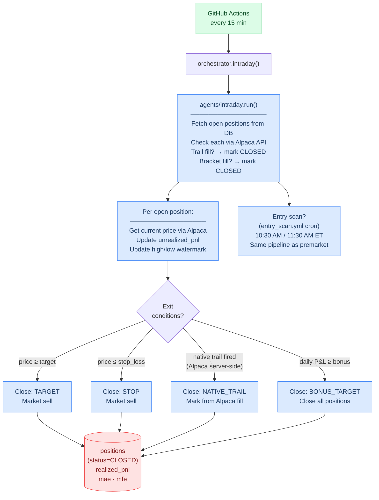
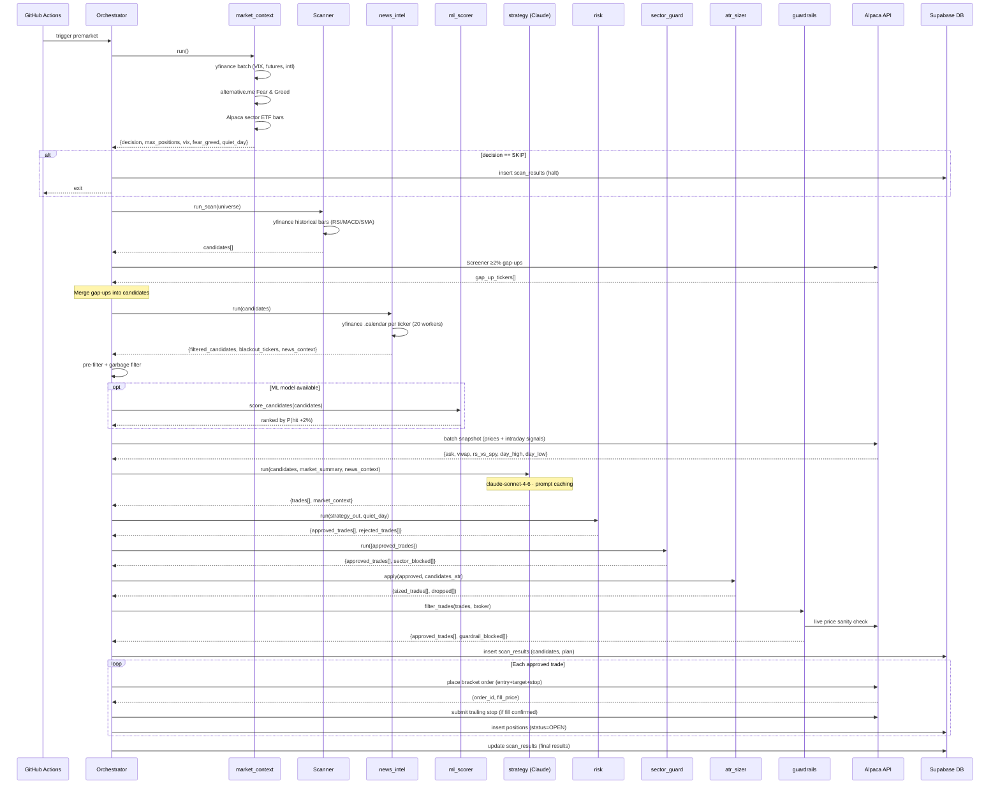
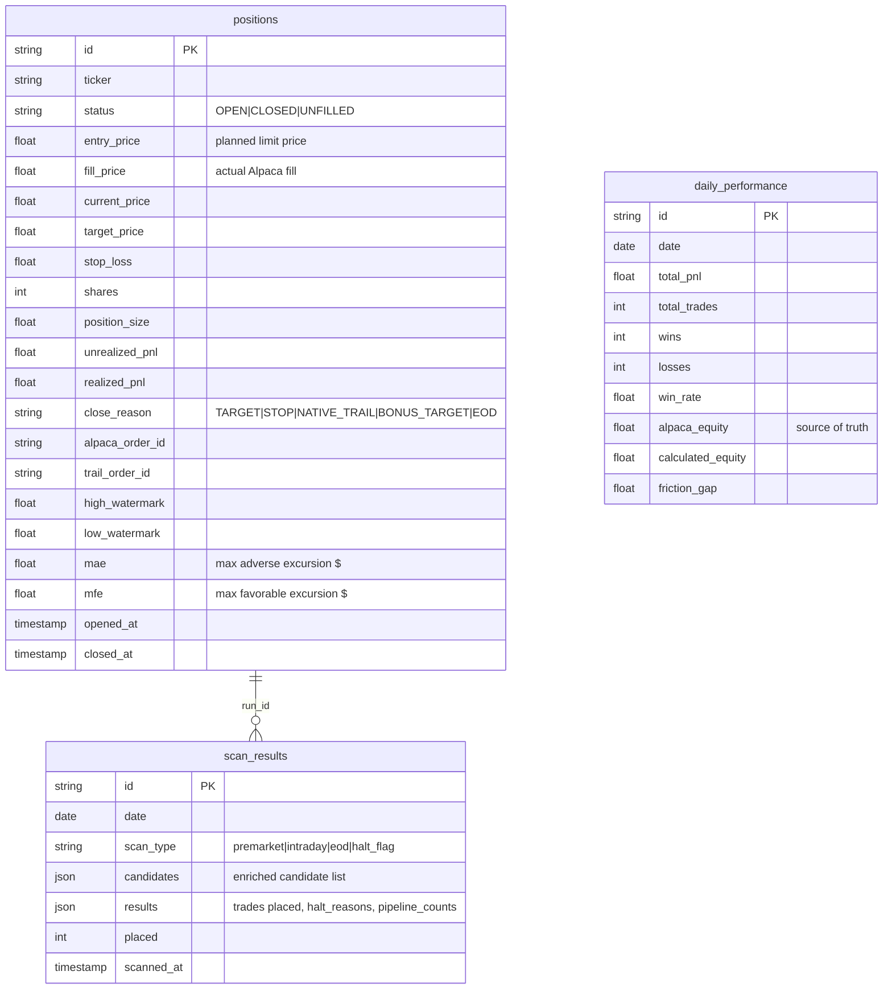
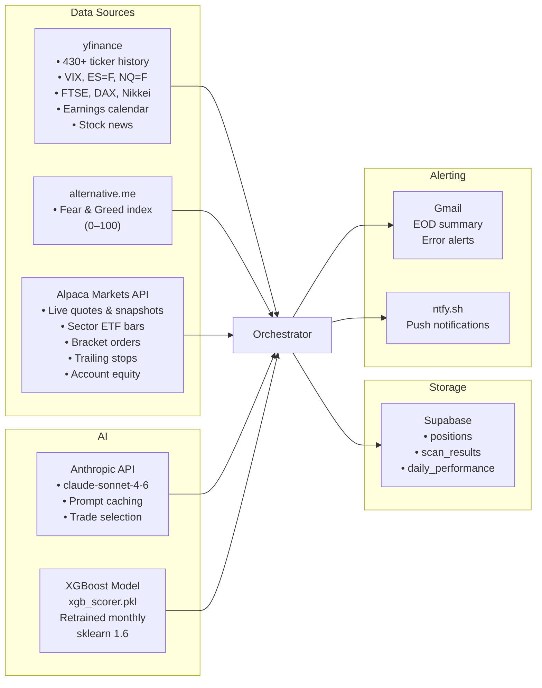

# Strategy A — Architecture

Single-strategy pipeline. One Claude call per day selects trades from a broad 430+ ticker universe. Three daily sessions: premarket scan, intraday position management, and EOD close.

---

## Daily Schedule

```
 8:45 AM ET   health_check.yml        Verify system is up
10:00 AM ET   trading.yml → premarket  Market scan → Claude → orders
10:00–3:59 PM trading.yml → intraday   Every 15 min: sync positions, trail/stop exits
 3:55 PM ET   trading.yml → eod        Force-close, reconcile, write performance
10:30/11:30AM entry_scan.yml           Intraday momentum re-scan (separate cron)
 1st of month retrain_model.yml        Retrain XGBoost ML scorer
```

---

## Full Premarket Pipeline

```mermaid
flowchart TD
    GHA["GitHub Actions\n10:00 AM ET"]:::infra --> PM["orchestrator.premarket()"]

    PM --> MC["① market_context.run()\n─────────────────\nyfinance: ^VIX, ES=F, NQ=F, YM=F\n  intl: FTSE, DAX, Nikkei\nalternative.me: Fear & Greed 0–100\nAlpaca: sector ETFs XLK…XLC"]:::agent
    MC --> |"decision · max_positions\nvix · fear_greed · futures_bias\nquiet_day · economic_events"| GATE{Market\nGate}

    GATE -->|SKIP| DONE["Log halt to scan_results\nExit early"]:::db
    GATE -->|GO / CAUTION| SCAN

    SCAN["② run_scan(universe)\n─────────────────\n430+ tickers\nRSI · MACD · SMA50/200\nVolume surge · ATR\nGap up %"]:::agent --> GAP

    GAP["② Gap-up injection\n─────────────────\nAlpaca Screener ≥2% movers\nMerge if in universe\n+ not already scanned"]:::agent --> NEWS

    NEWS["③ news_intel.run(candidates)\n─────────────────\nyfinance .calendar per ticker\nearnings blackout today/tomorrow\n20 workers · 30s timeout"]:::agent --> |"filtered_candidates\nblackout_tickers"| PF

    PF["Pre-filter\nmin technical_score"]:::filter --> GF

    GF["Garbage filter\nprice > 0 AND rsi ≠ None\n(removes warrants/illiquid)"]:::filter --> ML

    ML{ML Scorer\navailable?} -->|yes| MLS["④ ml_scorer.score()\n─────────────────\nxgb_scorer.pkl  sklearn 1.6\nXGBoost: P(hit +2%)\nRe-ranks candidates"]:::agent
    ML -->|no| ENRICH
    MLS --> ENRICH

    ENRICH["⑤ Live price + signals\n─────────────────\nAlpaca snapshot batch\nask price · VWAP · RS vs SPY\nday_high · day_low\ntoday_pct_change"]:::agent --> FILT

    FILT["Signal filters\n─────────────────\nExtension filter: >3% + vol<0.7x\nORB: logged, not hard-gated\nTop-of-range: >85% day range\nTrade cap: top N by score"]:::filter --> CLAUDE

    CLAUDE["⑥ strategy.run()\n─────────────────\nModel: claude-sonnet-4-6\nPrompt caching (ephemeral)\nInput: candidates + market summary\n  + sector guidance + news_context\nOutput: trades[]"]:::llm --> RISK

    RISK["⑦ risk.run()\n─────────────────\nDaily loss limit check\nMax positions check\nR:R ≥ 1.4 floor\nDuplicate guard"]:::agent --> SG

    SG["⑧ sector_guard.run()\n─────────────────\nMax 2 per sector\nDrops lowest confidence\nSECTOR_MAP lookup"]:::agent --> ATR

    ATR["⑨ atr_sizer.apply()\n─────────────────\nStop = max(ATR × 0.8, 0.5%)\n$150 constant dollar risk\nR:R ≥ 2.0 required\nDrops if ATR stop ≥ target"]:::agent --> GUARD

    GUARD["⑩ guardrails.filter_trades()\n─────────────────\nRequired fields check\nLive price sanity ±5%\nBuying power check\nBUY-only enforcement"]:::agent --> ORDERS

    ORDERS["⑪ place_orders()\n─────────────────\nAlpaca bracket order:\n  entry: limit (hybrid bid/mid)\n  target: limit take-profit\n  stop: stop-loss leg\nNative trailing stop submitted\nif USE_NATIVE_TRAILING_STOP=True"]:::infra --> DBWRITE

    DBWRITE[("scan_results\npositions\n(status=OPEN)")]:::db

    classDef agent fill:#dbeafe,stroke:#3b82f6,color:#1e3a5f
    classDef llm fill:#fef3c7,stroke:#f59e0b,color:#78350f
    classDef filter fill:#f3e8ff,stroke:#a855f7,color:#4a044e
    classDef infra fill:#dcfce7,stroke:#22c55e,color:#14532d
    classDef db fill:#fee2e2,stroke:#ef4444,color:#7f1d1d
```



---

## Intraday Session (Every 15 min, 10 AM–3:59 PM ET)



---

## Agent Handshakes — Sequence



---

## Data Model & Storage



---

## External Integrations



---

## Key Configuration

| Setting | Value | Effect |
|---|---|---|
| `TOTAL_CAPITAL` | $50,000 | Account size |
| `DAILY_PROFIT_TARGET` | $500 | Daily goal |
| `MAX_POSITIONS` | 10 | Concurrent open cap |
| `POSITION_SIZE_BY_CONFIDENCE` | HIGH=$3.5K / MED=$3K / LOW=$2.5K | Risk-based sizing |
| `TARGET_PCT` | 8% | Profit ceiling |
| `MIN_REWARD_RISK` | 2.0 | Min R:R after ATR sizing |
| `ATR_STOP_MULTIPLIER` | 0.8 | Stop = ATR × 0.8 |
| `ATR_STOP_FLOOR` | 0.5% | Minimum stop width |
| `MAX_LOSS_DOLLARS` | $150 | Constant dollar risk per trade |
| `DAILY_LOSS_LIMIT` | -$500 | Gate: no new trades |
| `TRAIL_PCT` | 1% | Native Alpaca trailing stop |
| `FG_EXTREME_FEAR` | 15 | F&G below this → max 5 positions |
| `STRATEGY_MIN_SCORE` | 5 | Pre-filter threshold |
| `UNIVERSE` | 430+ tickers | Scan universe |
